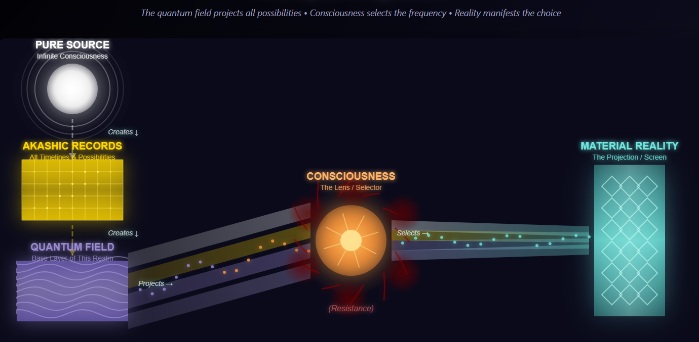

# Chapter 1: Energy is Everything

*The chair beneath you. The thoughts in your head. The breath moving through your lungs. The relationship that feels stuck. The dream that won't quite manifest.*

All of it is energy.

Not as a metaphor. Not as a spiritual platitude you're supposed to nod along with. As observable, measurable, physical reality.

Everything you can see, touch, think, or feel is energy in different states of vibration and organization. Your body? Atoms vibrating at specific frequencies, held together by electromagnetic forces. Your emotions? Neurochemical cascades creating electrical patterns in your nervous system. Your thoughts? Electrical impulses firing across neural networks. Money (currency) when you think about it is also energy. Your circumstances? The material manifestation of energy patterns you're broadcasting and receiving. 

When you truly grasp this, transformation stops being mysterious and starts being mechanical. Not mechanical in a cold, lifeless way, but mechanical in the way that light switches are mechanical. Predictable. Repeatable. Accessible to anyone willing to understand how the system works.

This book is about learning to work with energy directly. Not through complicated rituals or years of meditation or spiritual bypassing. Through simple, physics-based principles that are as reliable as gravity.

## The Master Equation

Here's the foundation everything else builds on:

**V = I × R**

This is Ohm's Law from electrical engineering. Voltage equals current times resistance. But it's also the fundamental equation of consciousness, the master key that unlocks transformation.

Let me translate:

- **V (Voltage)** = Voltage is Force in the equation. Your current life experience. Everything you're manifesting, experiencing, living right now. Your relationships, your bank account, your health, your emotional state, your opportunities. All of it.

- **I (Current)** = Current also known as amperage is flow. Source energy. The infinite creative force flowing through everything. The Tao. God. Universe. Whatever name feels right to you. The point is: it's constant. Always flowing. Always available. Always infinite.

- **R (Resistance)** = Resistance in this equation is opposition to the flow. The amount of resistance to force determines how much flow is possible. Your contractions, shadows, limitations, blocks. The patterns you're holding that restrict energy flow.

This formula is used by electricians and engineers to measure voltage, current, and resistance. All three aspects effect each other. When applied to "Everything is Energy", then everything that is possible in this universe is governed by resistance. 

Now here's what makes this equation so powerful:

**Current is constant.** 

Source energy isn't sometimes flowing and sometimes not. It's not more available on days when you meditate or less available when you mess up. It's not something you have to earn or deserve or be spiritual enough to access.

It's always there. Always flowing. Like gravity, like the sun behind the clouds, like electromagnetic force, like the fundamental constants of physics. Infinite. Constant. Available.

Which means your entire life experience, everything represented by V in this equation, is determined by exactly one variable:

**Resistance.**

Not your worthiness. Not your deservingness. Not whether you're evolved enough or worked hard enough or visualized correctly. Just resistance.

This changes everything.

It transforms personal development from "What do I need to get, learn, achieve, or become?" into a much simpler question: "What resistance am I holding that's blocking the natural flow of energy?"

## The State Problem vs. The Content Problem

Most personal development approaches treat transformation as if it's about understanding the right concepts, adopting the right beliefs, or thinking the right thoughts. They operate on the assumption that if you just knew enough, understood enough, believed enough, you would naturally transform.

This is completely backwards.

Think about water.

At 32°F, water is solid ice. At 70°F, it's liquid. At 212°F, it's steam. Same H₂O molecules, completely different states, completely different properties and behaviors.

The transformation from ice to steam isn't about the water learning something new about itself. It's not about the water adopting more empowering beliefs about its liquid nature. It's not about the water visualizing itself as steam or affirming "I am steam, I am steam, I am steam."

It's purely about energy and temperature.

Add energy, change state. Remove energy, change state. It's mechanical. Predictable. Physics.

Your consciousness works the same way.

When you're contracted, holding resistance, operating in survival mode, you're like ice. Rigid. Dense. Limited in how you can move and flow. You can still be beautiful like ice can be beautiful, but you're constrained by the state you're in.

When you dissolve resistance and allow energy to flow freely, you don't become a different person. You don't get new molecules. The same consciousness that was frozen becomes fluid, dynamic, capable of flowing into spaces it couldn't access before.

Same you. Different state. Different possibilities.

This is why so much traditional personal development fails. It treats transformation as a **content problem** when it's actually a **state problem**.

Content problems get solved through learning, understanding, and intellectual insight. State problems get solved through working with energy, through dissolving resistance, through creating the conditions that allow natural transformation to occur.

You can't think your way from ice to water. You have to add energy and allow the molecules to change state.

## What Is Resistance, Really?

If resistance is the only variable determining your experience, we need to understand what it actually is.

Here's what resistance is NOT:

It's not weakness. It's not failure. It's not something wrong with you. It's not evidence that you're broken or behind or not spiritual enough.

Here's what resistance IS:

**Resistance is your nervous system's intelligent adaptation to perceived threat.**

Every contraction you hold, every limitation you experience, every shadow you carry exists because at some point, your nervous system decided that holding this pattern was safer than releasing it.

This is crucial to understand: Your resistance isn't irrational. It's not random. It's not a character flaw.

When resistance formed, it made perfect sense.

Maybe you were five years old and your parents were fighting, and you discovered that if you stayed very quiet and made yourself small, you felt safer. So your nervous system learned: contraction equals safety.

Maybe you were twelve and you got excited about something and shared it with your class, and they laughed at you. So your nervous system learned: enthusiasm equals danger, better play it small.

Maybe you were twenty-two and you opened your heart completely to someone who betrayed that trust. So your nervous system learned: vulnerability equals pain, better stay guarded.

In each case, a younger version of you, faced with a situation they couldn't fully process, created a survival strategy. That strategy worked. It kept you safe. It helped you navigate a situation that felt overwhelming or threatening.

The problem isn't that the strategy was wrong then.

The problem is that it's still running now, decades later, in completely different contexts where it no longer serves you.

That contraction you learned at five? It's still running when you're trying to speak up in a business meeting at forty. That guardedness from twelve? Still operating when you're trying to launch your creative project. That protective wall from twenty-two? Still blocking intimacy in your current relationship.

Your nervous system is still trying to keep you safe using strategies designed for threats that no longer exist.

Understanding this changes how you work with resistance. You stop fighting it and start appreciating it. You recognize it as intelligent, even when it's limiting. And from that recognition, you can begin to create enough safety for it to release naturally.

## The Projection Model: Reality as Output

To work effectively with energy and resistance, you need to understand where material reality fits in the larger architecture of consciousness.

Here's the nested hierarchy:

**Source** → **Akashic Records** → **Quantum Field** → **Consciousness** → **Material Reality**

- **Source**: Pure undifferentiated potential. The ground of all being. The infinite.

- **Akashic Records**: The complete library of all possible experiences, timelines, and expressions. Every story that could ever be told.

- **Quantum Field**: The field of all possibilities, broadcasting every frequency simultaneously. Every potential reality existing as waves of probability.

- **Consciousness**: Your unique lens, your individual tuning, your particular frequency selector. The aspect of you that chooses which frequencies to tune into.

- **Material Reality**: The projection. The output. The manifestation that results from consciousness selecting specific frequencies from the quantum field.

This model reveals something most people get backwards:

**Material reality isn't the base level. It's the projection.**

It's the output, not the input. The shadow on the cave wall, not the light casting the shadow.

Imagine the quantum field as a projector displaying every possible image simultaneously. Your consciousness is the lens that selects which images to focus on and project into your experience.

When you're holding resistance, when you have contractions in your nervous system, unprocessed emotions, limiting beliefs, you're like a lens covered in smudges, scratches, and distortions. The projector is still broadcasting all possibilities, every frequency, every potential reality. But you can only see through your particular distortions.

This is why trying to change material reality directly rarely works.

When you use willpower to force a change, you're trying to change the projection without changing the lens. You're trying to rearrange the shadows without addressing the light source.

It can work temporarily. You can white-knuckle your way to behavior change through sheer force. But it requires constant energy expenditure, and the moment you relax, the old patterns reassert themselves because the lens hasn't changed.

Real transformation happens at the consciousness level. Change the lens, and the projection automatically changes.

Dissolve resistance, and you don't have to force yourself to see differently. There is already a natural force. When resistance is removed, the energy must flow in proportion to the resistance disolved. This is the physics of Ohm's Law. You naturally recognize frequencies that were always being broadcast but that you couldn't perceive through the distortions.

## Timeline Recognition: Everything Already Exists

Here's where this gets profound:

All possible timelines already exist in the quantum field. Neville Goddard calls this the 4th dimension. 

Not as potential. Not as maybe-someday. As actual, present, real frequencies broadcasting right now.

Your future self who has everything you want? They already exist. The version of you living your dream life? Already real, already present, already broadcasting their frequency.

The relationship you desire? The career that feels aligned? The health and vitality you're seeking? The creative expression that wants to flow through you?

All of it exists right now as actual timelines in the quantum field.

You're not trying to create these timelines. You're not manifesting them from nothing. You're not willing them into existence through positive thinking. You are selecting what timeline to align with

You're trying to **recognize** them. To tune into them. To allow your consciousness to select those frequencies from the infinite broadcast.

And the only thing preventing you from recognizing themS is resistance.

Every contraction you hold, every limitation you carry, every shadow you haven't integrated acts as a filter blocking certain frequencies. It distorts your lens so you can't perceive timelines that are already present.

As you dissolve resistance, you don't change what's possible. The possibilities are always there, always broadcasting, always available.

You select by recognizing what is already possible.

This is why breakthrough moments feel like "of course" rather than "wow, something new." Your biggest transformations often come with the sense that you're returning to something that was always true rather than becoming something you weren't.

You're not changing. You're recognizing.

The version of you that you're seeking? Already here. Already broadcasting. Already real.

Your work is to dissolve enough resistance that you can tune into that frequency.

## Looking Ahead: The Flow of Energy

Now that you understand the foundation, everything is energy and resistance is the only variable, the next question becomes obvious:

How does energy actually flow? What's the mechanism? What happens when energy gets blocked, and what allows it to flow freely again?

This is where geometry enters the picture.

Not as metaphor. Not as spiritual symbolism. As the actual architecture through which energy organizes itself.

In the next chapter, we'll explore how energy moves and what happens when it is resisted and how this understanding will enhance your own transformation.

Later we will look at the Seed of Life pattern and discover why breakthroughs aren'st linear but fractal, why each expansion creates exponentially more potential for the next, and how your resistance isn't blocking energy randomly but is creating specific geometric distortions that, once understood, become surprisingly workable.

But before we go there, let's give you a direct experience of the principles we've covered.

## Integration Exercise: Meeting Your Resistance

This isn't just intellectual understanding. Let's make it experiential.

Find a comfortable position, somewhere you won't be disturbed for five minutes. You can sit, lie down, or stand. Whatever allows your body to feel relatively at ease.

**Step 1: Locate the Resistance (1-2 minutes)**

Close your eyes or soften your gaze. Take a few natural breaths, nothing forced.

- Think of something you desire. Maybe it's better health, more wealth, closer relationships. Think big here. Whatever you choose is perfect and correct for you.
- With this desire in mind, ask yourself, "Why don't I have this yet?"
- Scan your body and your emotional state. Don't try to fix anything. Just notice:
- Where do you feel tension or tightness?
- Where does your body feel contracted or guarded?
- What emotion is present, even subtly, right now?
- If you were to point to where resistance lives in your body right now, where would you point?

Maybe it's tension in your shoulders. Tightness in your chest. A knot in your stomach. A sense of guardedness around your heart. Pressure in your head. Contraction in your throat.

There's no wrong answer. Just notice what's actually present.

**Step 2: Recognize the Intelligence (1-2 minutes)**

Now, without trying to change anything, acknowledge this to the resistance you're feeling:

"You formed for a reason. At some point, contracting like this felt like the safest option available. You're not a mistake. You're not weakness. You're an intelligent adaptation to something that felt threatening."

Notice if this perspective shift creates any change in the sensation. Often, simply recognizing resistance as intelligent rather than problematic creates a subtle softening.

**Step 3: Create Space (1-2 minutes)**

Finally, imagine you could create just 5% more space around this resistance. Not make it go away. Not fix it. Just allow a little bit more breathing room around it.

If it helps, you can physically gesture this. Put your hand where the resistance is, and then slowly move your hand a few inches away, as if giving the resistance more space.

Breathe naturally. Notice what happens.

You might feel a slight release. You might feel nothing change. You might feel the resistance get stronger before it softens. All of these are fine.

You're not trying to force transformation. You're creating the tiniest bit of safety, the smallest indication to your nervous system that this contraction doesn't have to work so hard right now.

**Step 4: Complete (30 seconds)**

Take one more breath. Open your eyes if they were closed.

Notice: You just worked with V = I × R directly. You didn't try to increase the current (Source energy is already infinite). You simply identified resistance and created a tiny bit more space for energy to flow.

That's the practice. That's the work.

Not fixing. Not forcing. Just recognizing, respecting, and creating space.

Do this exercise anytime you feel stuck, contracted, or blocked. It takes five minutes and directly applies the core principle of this entire framework:

**Energy is always flowing. Resistance is the only variable. And resistance, once recognized as intelligent, becomes surprisingly willing to release.**

---

*In Chapter 2 and in later chapters, we'll explore how energy flows through geometric patterns, revealing the architecture of evolution itself. You'll discover why breakthrough happens the way it does and how to work with the natural geometry of transformation rather than against it. First, let's explore resistance further.*

[Next Chapter](Chapter2.md)

[Return to The Table of Contents](../TableOfContents.md)

## Notes for Readers

*This chapter was released on 12-22-25.*