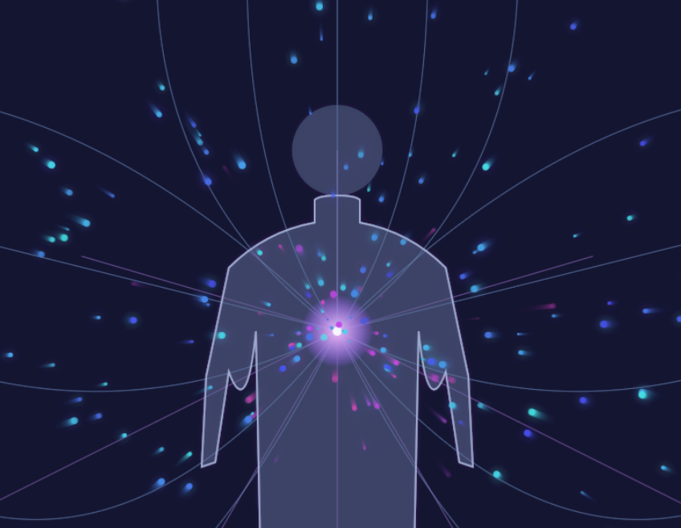

# Chapter 2: The Only Variable

*Resistance as the Sole Impediment to Flow • Why Energy Wants to Flow • From Physics to Psychology*

---

## Chapter Overview

Resistance is what slows down flow. If you remember from Chapter 1, there is a natural force in the universe. That force is an expansive force. When we follow this flow, we expand with it. When we resist the natural flow, we feel contracted. 

Here's the foundational principle: **health in any domain is the natural expression of energy flowing as intended. Dysfunction in any domain is the natural expression of energy not flowing as intended.** There is no judgement. It's either in flow or it isn't. This chapter explores how resistance operates as the only variable determining whether energy flows freely or gets blocked, and why understanding this simple truth changes everything about how we approach transformation in every domain of life.

**Key concepts introduced:**
- Health as natural energy flow across all domains
- Samskaras: the energetic blockages we create
- The cascade effect of resistance in our lives

**Prerequisites:** Chapter 1: Everything is Energy

---

## The Universal Pattern of Flow

Remember Ohm's Law from Chapter 1: V = I × R. Voltage equals current times resistance. Energy wants to flow. The universe is fundamentally expansive. Every system, from rivers to electrical circuits to human consciousness, follows the same principle: energy flows naturally unless something blocks it.

Think about a river. Water doesn't need convincing to flow downstream. It doesn't need motivation or willpower. Given an open path, water flows because that's what water does. The only thing that interrupts this flow is resistance: rocks, dams, debris. With no obstruction to the flow of the river, the river is naturally expressing the flow of energy.

Your life works exactly the same way.

Health, wealth, clarity, connection, creativity... these aren't things you have to chase or manufacture. **They're the natural expression of unobstructed energy flow.** When you experience lack, struggle, disease, or confusion, you're not experiencing the absence of something you need to acquire. You're experiencing resistance blocking what's already trying to flow through you. Dysfunction is simply the natural expression of energy not flowing as intended.

This is the most important shift in perspective you can make: **You don't need to fix yourself. You need to remove what's blocking your natural flow.** This is empowering. We have this ability. We just need to learn how to use this ability. 

## Health as Flow

Let's start with the most obvious domain: your physical body. What is health?

Most people think of health as something you achieve through effort: the right diet, the right exercise, the right supplements. And yes, these things matter. But they matter because they either support or obstruct energy flow. They're not creating health; they're removing resistance to the health that already wants to exist.

**Health is not something you build. Health is the natural expression of energy flowing as it's designed to flow.** Your body knows how to be healthy. Every cell knows its function. Every system knows how to self-regulate. When energy flows freely through your physical form, health is the inevitable result.

Each of us is different. We have different tolerances. Some are more sensitive to certain environment conditions. Think of someone with allergies. When certain environment conditions happen, their allergies block energy and they have an allergic reaction. This same environment condition doesn't effect everyone.

When your body is healthy, energy flows freely. Your heart pumps blood without strain. Your lungs exchange oxygen effortlessly. Your digestive system processes nutrients and eliminates waste smoothly. Your nervous system sends signals clearly. Your immune system responds appropriately to threats.

This is your body's natural state. Health isn't an achievement; it's what happens when nothing blocks the flow. **Disease, by contrast, is the natural expression of energy not flowing as intended.**

Now consider what happens when you introduce resistance:

**Physical resistance:** You eat foods that inflame your system. You sit for twelve hours without movement. You hold tension in your shoulders for decades. You breathe shallowly into your chest instead of deeply into your belly. Each of these creates blockage. The energy that wants to flow through your body encounters obstacles. Over time, these blockages accumulate. 

**Disease develops not because something invaded from outside, but because the natural flow within got obstructed.** Your body is naturally trying to express health. When it can't, when energy can't flow as intended, dysfunction is the natural result. A tumor isn't a foreign object; it's cells whose energy flow got so disrupted they forgot their purpose. Inflammation isn't an enemy; it's your body's natural response to blocked flow trying to clear the pathway. Pain isn't punishment; it's signal that energy isn't moving as it should.

But physical health is just one domain. Let's expand the lens.

**Financial health** is also energy flow. Money is simply crystallized energy moving through social systems. When your relationship with money is free of resistance, it flows naturally: in through value you provide, out through exchanges that serve your life, around through circulation that creates abundance for everyone involved. Another name for money is literally currency. 

**Financial abundance is the natural expression of energy flowing through your economic life.** You don't create wealth by forcing or grinding; you allow it by removing whatever blocks its natural flow. Financial struggle, debt, scarcity... these aren't signs that you're bad with money. They're signs that energy isn't flowing as it's designed to flow through your financial domain.

Financial resistance looks like: fear-based saving that prevents investment in growth; scarcity thinking that blocks receiving; shame around wealth that prevents earning; compulsive spending that prevents accumulation; isolation that prevents collaboration; hiding that prevents visibility. Each of these is a boulder in the river of financial energy. Remove the boulders, and the wealth that's been trying to reach you finally can.

**Mental health** follows the same pattern. When your mind is clear of resistance, thoughts flow naturally. You experience emotions fully and they pass through you. You perceive reality without excessive distortion. You respond to circumstances with appropriate flexibility.

**Psychological wellness is the natural expression of mental and emotional energy flowing as intended.** Your mind doesn't need fixing; it needs clearing. Anxiety isn't a chemical imbalance you're cursed with; it's information that  energy is circling instead of flowing because something blocks its natural path. Depression isn't a character flaw; it's life force that got so obstructed it collapsed inward instead of moving through you.

Mental resistance manifests as: rumination (thoughts circling instead of flowing); suppression (blocking emotions from moving through); rigidity (clinging to beliefs despite contradictory evidence); fragmentation (parts of yourself at war with other parts); disconnection (numbness preventing natural emotional flow). Every mental health challenge is, at its core, an expression of energy not flowing as it's designed to flow.

**Intellectual clarity** is perhaps the most immediately recognizable example. Remember a time you wanted to recall a piece of information during a test or important conversation. You knew you knew it. The information was right there, just beyond reach. The harder you tried to grasp it, the further it retreated. Then hours later, when you finally stopped trying, it popped into awareness effortlessly.

That's resistance. Your straining created blockage. When you relaxed, the information flowed naturally.

**The pattern is identical across every domain: health is the natural expression of energy flowing as intended, dysfunction is the natural expression of energy not flowing as intended.** This isn't metaphor. It's mechanism. And once you see this pattern, you can't unsee it. Every problem you face, every challenge, every stuck place in your life... they're all just energy encountering resistance. Remove the resistance, and the energy flows. When energy flows, health returns. Not because you fixed something broken, but because you removed what was blocking what was already trying to work.

This reframe changes everything. You're not deficient. You're not broken. You're not lacking anything fundamental. **You're experiencing the natural consequence of blocked flow of energy.** And just as blockage is natural when resistance is present, flow is natural when resistance dissolves. Health in all its forms is your birthright. It's what happens automatically when you stop interfering with what wants to emerge.

## The Architecture of Blockage

So where does resistance come from? Why do we block flow if flow is our natural state?

This is where we need to introduce a concept from Vedic philosophy: **samskaras**.

Michael Singer describes samskaras beautifully in *The Untethered Soul*. Samskaras are impressions or blockages stored in consciousness. They're like energetic scars, formed when we couldn't fully process an experience. Instead of allowing the energy of the experience to move through us completely, we resisted it. We tightened around it. We blocked it. And that blocked energy remains as a samskara, a point of resistance that affects all future flow.

Here's how it works:

Something happens. Maybe you're five years old and your parent yells at you for spilling juice. In that moment, you feel a wave of shame and fear. That's energy moving through you. If you were able to feel it fully and let it pass, it would leave no trace. But as a five-year-old, that intensity is overwhelming. Your nervous system can't process it. So you do what every human does: you contract around it. You tighten. You push it down. You block the energy.

That blocked energy becomes a samskara. 

Now, thirty years later, someone criticizes your work. Objectively, it's just feedback. But your system encounters that samskara. The old blocked energy gets triggered. Suddenly you're not responding to present circumstances; you're reacting from that five-year-old's unprocessed shame and fear. You might get defensive. You might shut down. You might attack. You might people-please. Whatever your pattern, it's not flowing; it's blocked.

This is how resistance accumulates. Experience by experience, moment by moment, we create blockages. Not because we're broken or weak, but because we're human. Because sometimes the intensity is more than our system can handle in real-time. Because we were taught to suppress rather than process. Because we learned that certain emotions weren't acceptable. Because we didn't know there was another way.

The key insight: **Your resistance isn't random. It's intelligent.**

Every samskara formed because your nervous system did the best it could to protect you in that moment. The tightening, the blocking, the shutting down... these were adaptive responses. They made sense given your resources and circumstances at the time.

Here's what's crucial to understand: what was adaptive then might not be adaptive now. The five-year-old needed to block that shame because they couldn't process it fully. The thirty-five-year-old has vastly more capacity, but that samskara still triggers the same protective response. The blockage that once served now just obstructs flow.

And samskaras don't just stay isolated. They connect. They form networks. Each similar experience adds to the blockage. Your samskara around criticism doesn't just hold the energy from that one childhood incident. It accumulates every similar experience: the teacher who embarrassed you in third grade, the partner who mocked your dreams, the boss who dismissed your ideas, the friend who betrayed your trust.

Layer upon layer, the resistance builds. The blockages compound. The flow narrows.

## The Cascade Effect

Now let's zoom out to see the full picture of how resistance operates across all domains simultaneously.

Remember: everything is energy. You are not separate systems, one physical, one financial, one mental. You're a unified field of energy expressing through different domains. **When resistance exists anywhere, it affects flow everywhere. When energy flows freely anywhere, it supports flow everywhere.**

This is critical to understand: health and dysfunction are both contagious across your entire system. A blockage in one domain cascades into other domains. Flow in one domain catalyzes flow in others. You're witnessing the natural expression of a unified energetic system, not isolated problems requiring isolated solutions.

Consider someone who experiences a major financial loss. The immediate domain is obvious: financial flow gets constricted. But watch how it cascades:

The financial stress creates mental resistance. Worry loops start. Sleep becomes difficult. That's mental energy getting blocked, circling instead of flowing.

Poor sleep affects physical health. The body can't repair itself fully. Inflammation increases. Energy drops. That's physical flow getting obstructed.

Low energy affects relationships. They snap at their partner. They withdraw from friends. That's relational energy getting blocked.

Relationship strain affects self-worth. They feel like a failure. Shame accumulates. That's spiritual/emotional energy getting blocked.

And all of this creates more financial resistance. Making good decisions requires clarity. Clarity requires energy. Energy requires flow. But now every system is constricted. The very resource they need to resolve the financial situation is what the financial situation has blocked.

This is the cascade effect of resistance. One blockage doesn't stay isolated. It ripples through your entire system, creating more blockages, which create more ripples, which create more blockages. **Each dysfunction is a natural expression of energy unable to flow as it's designed to flow. And because you're a unified system, blocked energy in one domain naturally expresses as blocked energy in every domain.**

**But here's the beautiful flip side:** flow cascades too. Just as dysfunction naturally spreads through a blocked system, health naturally spreads through a flowing system.

When you remove resistance in one domain, it affects every domain. When you learn to relax your nervous system, that physical release creates mental clarity. Mental clarity improves decision-making. Better decisions improve finances. Financial ease reduces stress. Less stress improves relationships. Better relationships nourish your sense of self. A nourished sense of self creates more capacity to relax. And the upward spiral continues.

**This is health naturally expressing itself across all domains.** You're not forcing anything. You're not manufacturing wellness in each separate area. You're removing one point of resistance, and the energy that was always trying to flow finally can. That flowing energy naturally expresses as health wherever it moves. Physical vitality. Mental clarity. Emotional resilience. Financial abundance. Relational depth. Creative inspiration. All of it is the same energy, flowing freely, naturally expressing as health in whatever domain it inhabits.

This is why the work of removing resistance is so powerful. You're not just fixing one problem in one area. You're clearing blockages that affect your entire system. Every point of resistance you dissolve makes it easier to dissolve the next one. Every increase in flow makes more flow possible. **Health begets health because health is simply energy flowing as it's designed to flow.**

## From Fixing to Flowing

This understanding fundamentally changes how you approach transformation.

The conventional approach treats problems as deficiencies to fix. You're not healthy enough, so you need to work harder at health. You're not wealthy enough, so you need to hustle more. You're not happy enough, so you need to think more positively. You're not successful enough, so you need to develop better strategies.

This approach assumes you lack something you need to acquire. It treats dysfunction as the natural state and health as something you must build through effort. And it generates more resistance because it's fundamentally based on the belief that you're inadequate as you are.

The flow approach recognizes the opposite: **health is the natural state and dysfunction is what happens when something blocks that natural state.** Health, wealth, happiness, success... all of these are natural expressions of energy flowing as it's designed to flow. They emerge when resistance dissolves. You don't need to become something other than what you are. You need to remove what's blocking what you already are.

This isn't just feel-good philosophy. It's practical physics applied to consciousness.

When you understand that resistance is the only variable, your entire strategy shifts:

Instead of: "How do I get more motivated?" → "What resistance prevents natural motivation from flowing?"

Instead of: "How do I make myself do the right things?" → "What makes the right things feel like resistance instead of flow?"

Instead of: "How do I fix my anxiety?" → "What's the blockage creating the circling energy I experience as anxiety?"

Instead of: "How do I attract abundance?" → "What resistance blocks the abundance trying to reach me?"

See the difference? One approach adds effort. The other removes obstruction. One builds on a foundation of inadequacy. The other recognizes your fundamental wholeness.

And here's what makes this practical: removing resistance is learnable. You don't need special gifts. You don't need decades of meditation practice. You need to understand the mechanism and work with it skillfully.

Every technique in this book, every practice, every framework... they all serve one function: helping you recognize and dissolve resistance so natural flow can resume.

## Why This Matters for Leaders

If you're reading this book, you probably carry significant responsibility. People depend on you. Your decisions affect others. The weight of this responsibility often becomes a source of tremendous resistance.

You might tell yourself: "I can't relax; there's too much at stake." "I can't let my guard down; people are counting on me." "I can't show uncertainty; I need to project confidence." "I can't take time for myself; there's too much to do."

Each of these is a boulder in your river. Ironically, each of these blockages prevents you from being the leader you want to be.

The most effective leaders aren't the most stressed. They're not the ones grinding themselves into the ground. **They're the ones with the least resistance. They're the ones whose leadership is the natural expression of energy flowing through them rather than forced performance despite blocked energy.**

True leadership capacity is energy flowing clearly through you and into your decisions, your presence, your influence. When you're blocked, you're not leading from your full capacity. You're leading from whatever small percentage of energy can squeeze through your constricted channels. Your best thinking, your deepest wisdom, your most creative solutions, your most authentic presence. All of that requires flow.

Flow doesn't mean careless. It doesn't mean irresponsible. It doesn't mean checking out. Flow means responding to what's actually present instead of reacting from old blockages. It means accessing your full capacity instead of operating from a constricted state. It means leading from your natural wisdom instead of from your accumulated resistance.

The people depending on you don't need a perfect leader. They need a clear one. **Clarity is the natural expression of mental energy flowing freely.** It's what emerges when resistance dissolves. Flow comes from dissolved resistance.

This is why your personal transformation isn't selfish. It's the most generous thing you can do. Every point of resistance you clear in yourself creates more capacity to serve others. Every increase in your flow creates more space for others to flow. **Your health, naturally expressed, creates permission and space for their health to naturally express.** Your wholeness creates permission for their wholeness.

## The Practice of Recognition

So how do you actually work with this? How do you identify resistance and begin to dissolve it?

The first step is simply recognition. You can't dissolve what you don't notice. And most resistance operates invisibly, disguised as "just how things are" or "just who I am."

Start paying attention to contraction. Resistance always feels like some form of tightening, narrowing, closing, hardening. It might be physical: tension in your shoulders, tightness in your chest, shallow breathing. It might be mental: ruminating thoughts, rigid positions, defensive reactions. It might be emotional: suppressed feelings, forced positivity, numbing patterns.

Whenever you notice contraction, pause. Don't try to fix it. Don't judge it. Just notice: "Oh, there's resistance here." As you do this more and more life becomes a teacher. On a moment by moment you notice when resistance comes up. This could be in a meeting, something that someone says or does, an event. Just notice, relax, and loosen. The resistance will work through you. 

That simple act of recognition is profound. Most people spend their entire lives operating from resistance without ever recognizing it. The moment you see it, you've already begun to change your relationship with it.

The second step is curiosity. Instead of immediately trying to dissolve the resistance, get interested in it. What is it protecting you from? What does it believe will happen if it releases? What's the fear underneath the tightening?

Remember: resistance is intelligent. It formed for a reason. When you approach it with curiosity rather than force, it begins to reveal its logic. And once you understand its logic, you can work with it skillfully.

The third step is creating safety. Resistance dissolves when your nervous system feels safe enough to release it. You can't force dissolution. You can't think your way out of resistance. You can only create conditions where release becomes possible.

In the Integration Practice that follows, you'll begin to feel this process directly. You'll experience the difference between flow and resistance. You'll practice the simple act of noticing blockage and allowing release. This is foundational work. Don't underestimate its power.

## Looking Ahead

Resistance is the only variable. Understanding this intellectually and experiencing it viscerally are different things. In the chapters ahead, we'll explore specific techniques for dissolving resistance across different domains. We'll look at the geometry of how energy actually flows and why breakthrough happens in quantum leaps rather than linear progression. We'll examine the nested hierarchy of reality and how consciousness creates your experience at every level.

But all of that builds on this foundation: energy wants to flow. Resistance is what blocks it. Your work is not to create something new but to remove what's in the way of what's already trying to emerge.

This is simultaneously the simplest and most profound truth you can work with. Simple because it's just one variable. Profound because that one variable determines everything.

---

## Integration Practice: Visualizing Flow

**Purpose:** Experience the felt difference between natural flow and resistance, and practice the simple act of recognizing and releasing blockages.

**Time required:** 5-10 minutes

**What you'll need:** Just you, your awareness, and your imagination.

**Instructions:**

**1. Settle into relaxation**

Take three deep breaths to begin relaxing your body and mind. Many people find it easiest to breathe in for four seconds and out for four seconds. With each exhale, allow any energy that isn't serving you to release. You're not forcing anything out; you're simply letting go of what wants to leave.

Notice your body settling. Notice your mind becoming quieter. There's nothing you need to do except be present for a few minutes.

**2. Visualize natural flow**

Bring to mind a healthy river flowing through a natural landscape. You might picture a river you've actually seen, or you might create one in your imagination. Notice how the water simply moves. It doesn't strain. It doesn't effort. It flows because that's what water does when the path is clear.

Feel this in your body. Allow a sense of ease and movement to emerge from the center of your chest and flow outward through your entire system. You're not making this happen; you're recognizing the flow that's already present beneath your usual resistance.

Stay with this feeling for at least a minute. Let yourself really sense what unobstructed energy feels like.

**3. Notice resistance**

Now imagine someone starts placing large boulders into your flowing river. Watch what happens. Rapids form. Eddies and jetties appear. The water still flows, but it's turbulent, choppy, fighting against the obstacles.

Notice how this feels different from the smooth flow. The same energy is present, but now it's encountering resistance. The movement becomes struggle.

Let yourself feel this in your body. Where do you notice tightening? Where does ease become effort? You're not trying to change anything yet, just noticing the difference.

**4. Practice release**

Now visualize a crane arriving and gently lifting the boulders out of the river, one by one. As each boulder rises from the water, the flow beneath it smooths out. The water stops fighting. It returns to its natural state.

The boulders weren't permanent. They weren't part of the river. Someone put them there. And someone can remove them.

As you watch this, let your body mirror the process. Whatever tightened in step three, let it soften now. You placed the resistance there. You can remove it. Not through force. Through recognition and release.

The river teaches you: flow is natural, resistance is added. And what's added can be released.

**Reflection prompts:**

- Where in your life right now does it feel like you're water encountering boulders?
- What specific resistance can you identify? Physical tension? Mental loops? Emotional suppression? Financial constriction?
- What would become possible if you removed just one boulder?
- Journal prompt (if it feels right): Write about what natural flow feels like in your body. When was the last time you experienced true ease in any domain of your life?

**Common experiences:**

You might notice that as you visualize the boulders being removed, your body spontaneously softens. This is your nervous system releasing held tension. Let it happen. You might take a deeper breath. You might feel warmth spreading through your chest. You might notice emotions surfacing. All of this is natural flow resuming.

Some people feel resistance to the exercise itself. If that happens, notice it with curiosity rather than judgment. The part of you that doesn't want to relax is a boulder worth examining. What does it believe will happen if you let go?

**Troubleshooting:**

**If you have trouble visualizing:** Not everyone thinks in pictures. Do you notice the feeling of a naturally flowing river? Can you hear it flowing? Can you sense its movement? Some people are more auditory or kinesthetic than visual. We're all different. Just notice. This exercise may teach you which sensation is your dominant way of experiencing.

**If the resistance feels too big to remove:** Start smaller. You don't need to remove every boulder in one session. Can you just shift one slightly? Can you imagine even a tiny bit of flow returning? Progress isn't linear. Sometimes the smallest release creates the biggest cascade.

**If nothing seems to happen:** That's information too. Maybe you're more blocked than you realized. Maybe you need more safety before release becomes possible. That's okay. The practice of recognition still matters. You can't dissolve what you don't see. You've begun.

---

## What's Next

In Chapter 3, we'll explore the nested hierarchy of reality itself. You'll discover how consciousness operates at multiple levels simultaneously: from Source (pure infinite consciousness) through the Akashic Records (the library of all possibility) to the Quantum Field (this realm's rendering engine) to the material reality you navigate daily. Understanding this architecture reveals why transformation can happen instantaneously and how you can work with reality at its source level rather than just trying to rearrange the furniture in the physical dimension.

---

[Next Chapter](Not Released)

[Return to The Table of Contents](../TableOfContents.md)

## Notes for Readers

*This chapter was released on 12-23-25 (Happy Festivus).*