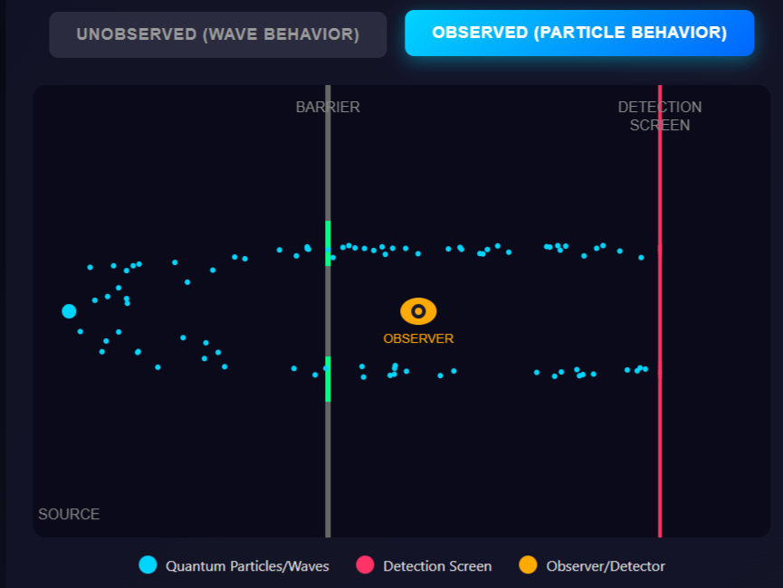
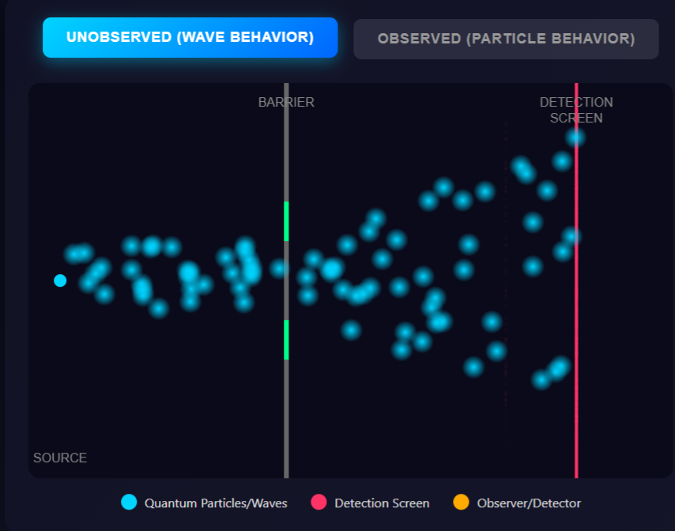

# Chapter 3: The Nested Hierarchy

*Source: Pure Infinite Consciousness • The Akashic Records: The Library of All Possibility • The Quantum Field: This Realm's Rendering Engine • Why Material Reality Isn't "Real"*

---

## Chapter Overview

Resistance is what slows down flow. In Chapter 1, you learned about the natural expansive force in the universe. When we follow the flow, we expand with it. When we resist the natural flow, we feel contracted. But to truly understand how to work with this flow at its source, we need to understand the architecture of reality itself.

This chapter reveals the nested hierarchy through which consciousness expresses into form. You'll discover how reality operates at multiple levels simultaneously, from pure Source consciousness through the Akashic Records and Quantum Field to the material dimension you navigate daily. Understanding this structure changes everything about how you approach transformation because it reveals that you can work with reality at its causal levels rather than just trying to rearrange effects.

**Key concepts introduced:**

- Pure Consciousness as the fundamental substrate of existence
- The Akashic Records as the complete library of all possibility
- The Quantum Field as this realm's rendering engine
- Why material reality represents information, not ultimate truth
- How beliefs create blockages in the natural energy flow

---

## The Architecture of Reality

Imagine reality as a nested set of Russian dolls, each level containing and expressing through the next. At the outermost layer, you interact with material reality: solid objects, physical bodies, tangible results. But this visible dimension represents only the final rendering of a much deeper structure.

Most people spend their entire lives rearranging furniture in the material dimension. They try to change outcomes by manipulating physical circumstances, pushing against resistance, forcing results through sheer effort. This approach works, but it's the hardest possible path because you're working at the level of effect rather than cause.

The nested hierarchy reveals something profound: material reality isn't the source of anything. It's the screen onto which deeper levels of consciousness project. Understanding this architecture opens access to working with reality at its causal levels, where change happens instantaneously and effortlessly.

---

## Level 1: Pure Source Consciousness

At the foundation of everything sits Pure Source Consciousness. This isn't consciousness of something or consciousness in something. This is consciousness itself, infinite and undifferentiated. Pure potential. Pure awareness. The field from which all experience arises.

Source represents the zero point, the void, the pregnant emptiness that contains all possibility. In Taoist philosophy, this is the Wu Chi, the limitless. In physics, this is the zero-point field. In spiritual traditions, this is God, Brahman, the Absolute. Different names for the same foundational reality: pure consciousness before it takes any form.

This level has no resistance because it has no form to resist. It simply IS. All energy originates here as pure, undifferentiated potential. The natural expansive force you learned about in Chapter 1 flows from this source. When you're completely relaxed, surrendered, in flow, you're touching this level directly.

Think of Source as the white light before it passes through a prism. It contains all frequencies, all possibilities, but hasn't differentiated into specific colors yet. No separation exists here. No subject and object. No observer and observed. Just pure, infinite, conscious awareness.

---

## Level 2: The Akashic Records - The Library of All Possibility

As Source consciousness begins to differentiate, the first level of structure emerges: the Akashic Records. This represents the complete library of all possibility, the total information field of everything that has existed, does exist, and could exist. Everything is energy, the Akashic Records are a record of all energy every where as well as every when. The records are timeless.

In Sanskrit, Akasha means "ether" or "space." It refers to the primary substance that makes up reality. The Akashic Records aren't a dusty library in the clouds where some cosmic librarian files away events. They represent the fundamental information structure of the universe itself.

Here's the key insight: everything that can possibly exist already exists as a pattern in the Akashic Records. Every version of your life, every potential outcome, every possible timeline already has a complete energetic template recorded in this field. The question isn't whether your desired reality exists. It does. The question is whether you're an energetic match to access that frequency.

Think of it this way: every song that could ever be written already exists as a potential combination of sound frequencies. A composer doesn't create music from nothing. They access and arrange frequencies that already exist in the field of possibility. Similarly, you don't create your desired reality. You become an energetic match to the frequency where that reality already exists.

This is why transformation can happen instantaneously. You're not building something new from scratch. You're removing the resistance that blocks your access to what already exists. When you dissolve a resistance pattern, you don't gradually create change. You suddenly snap into alignment with a different frequency in the Akashic Records.

The Akashic Records operate like an infinite hologram. Every point contains the whole. Every possibility exists simultaneously, not in linear time but in the eternal now. Your consciousness navigates through this library not by moving through space or time, but by changing its vibrational frequency.

---

## Level 3: The Quantum Field - This Realm's Rendering Engine

The Quantum Field represents the translation layer between pure possibility and physical manifestation. If the Akashic Records are the complete library of all potential patterns, the Quantum Field is the mechanism that renders specific patterns into experienceable reality.

Modern physics has discovered something remarkable: at the quantum level, particles don't have definite properties until they're observed. Before measurement, electrons exist as probability waves, occupying all possible positions simultaneously. Only when consciousness interacts with the field does the wave function collapse into a specific, measurable state.

This isn't philosophy. This is verified experimental physics. The famous double-slit experiment proves it elegantly: send electrons through two slits without observing them, and they create an interference pattern showing they went through both slits simultaneously. Observe which slit they go through, and the interference pattern disappears. They suddenly behave like particles going through one slit or the other.

Consciousness isn't passively observing reality. Consciousness is actively selecting which possibility becomes actual.

The Quantum Field responds to the frequency you're broadcasting through your beliefs, emotions, and nervous system state. Your resistance patterns create specific vibrational signatures that the field matches. When you're in resistance, the field renders realities that match that contracted frequency. When you're in flow, the field renders realities that match that expanded frequency.

Think of the Quantum Field as a radio receiver. All stations broadcast simultaneously. Your consciousness functions as the tuning dial. Resistance creates static that blocks certain frequencies. The Cascade Sequence (Surrender → Relaxing → Loosening) clears the static, allowing you to tune into different stations that were always broadcasting.

At the quantum level, bosons function as the fundamental force carriers. Photons carry electromagnetic force. Gluons bind quarks together. W and Z bosons mediate radioactive decay. These elementary particles represent the machinery through which the field translates possibility into actuality. They're the pixels in the rendering engine, assembling specific configurations from the infinite potential of the Akashic Records.

The quantum realm operates outside ordinary time and space. Particles can be entangled across vast distances, responding to each other instantaneously. This non-locality reveals something profound: the separation you perceive in material reality doesn't exist at the quantum level. At the fundamental level of reality, everything remains connected in a unified field.

---

## Level 4: Material Reality - The Final Rendering

Material reality represents the final output of this nested hierarchy. The solid, tangible world of objects and bodies and measurable results. But here's what changes everything: material reality isn't the source of anything. It's the screen onto which the deeper levels project.

Your physical circumstances don't create your experience. Your experience creates your physical circumstances. Material reality always reflects the frequency you're broadcasting from the quantum level, which reflects the pattern you're aligned with in the Akashic Records, which reflects the particular way Source consciousness is expressing through your unique awareness.

This is why trying to change outcomes by manipulating physical circumstances feels like pushing against resistance. You're working at the level of effect. It's like trying to change a movie by rearranging the images on the screen instead of changing the film in the projector.

But here's the liberation: once you understand the nested hierarchy, you can work with reality at its causal levels. Instead of trying to force physical changes, you address the resistance patterns that determine which frequency you're tuned to. The physical results shift automatically because they're simply the final rendering of your vibrational state.

Material reality isn't "unreal" in the sense that it doesn't exist. The screen displaying the movie exists. But the images on the screen aren't the source of the story. They're the manifestation. Understanding this distinction gives you access to the controls.

The fish doesn't know it's in water because water is all it has ever known. Similarly, most humans don't recognize that material reality is information rendered into experienceable form. They mistake the rendering for the source. They believe the screen is creating the movie.

But you're reading this book, which means you're ready to see beyond the screen. You're ready to work with the projector, the film, and ultimately the consciousness that chose what movie to play in the first place.

---

## How Beliefs Create Blockages

Your beliefs operate at the interface between the Quantum Field and material reality. They function as filters that determine which frequencies you can access from the Akashic Records and how the Quantum Field renders your experience.

A belief is simply a thought pattern you've practiced enough to feel true. It creates a specific vibrational signature that the Quantum Field matches. If you believe "making money is hard," that belief creates resistance to the frequencies where money flows easily. Those easy-money timelines exist in the Akashic Records. The Quantum Field could render them. But your belief creates a blockage that prevents you from accessing that frequency.

Remember from Chapter 2 that resistance is the only variable. Energy wants to flow. The natural force of the universe is expansive. But beliefs create contractions in your field that block natural flow.

Here's what makes this challenging: most of your resistance-creating beliefs operate subconsciously. Your conscious mind might say "I want abundance," while your subconscious broadcasts "resources are scarce and people like me struggle." The Quantum Field doesn't respond to your conscious intentions. It responds to your actual vibrational frequency, which is determined by your nervous system state and subconscious programming.

This is why insight alone rarely creates lasting change. Understanding that a belief is false doesn't necessarily dissolve the resistance pattern. The pattern exists as an energetic contraction in your field, usually accompanied by a specific nervous system activation. To truly release it, you need to create enough safety for the nervous system to relax its protective stance.

The nested hierarchy reveals why this works: beliefs don't exist in material reality. They exist as patterns in the Quantum Field that filter your access to the Akashic Records. When you dissolve a belief at the energetic level (through the Cascade Sequence, forgiveness practices, or deep subconscious work), you literally change which frequencies you can access. The material reality shifts automatically because it's just the final rendering.

---

## Working at the Source Level

Understanding the nested hierarchy fundamentally changes how you approach transformation. Instead of trying to change outcomes by manipulating material circumstances, you work at the causal levels:

**At the Consciousness level:** You recognize yourself as the awareness observing all experience, not as the temporary forms consciousness takes. This recognition itself dissolves the primary resistance pattern that believes separation is real.

**At the Akashic level:** You understand that your desired reality already exists as a complete pattern. You're not trying to create something new. You're removing the resistance that blocks your access to what already is.

**At the Quantum level:** You address the resistance patterns in your field that determine which frequencies the Quantum Field renders into your experience. The Cascade Sequence, forgiveness practices, and nervous system regulation directly shift your vibrational signature.

**At the Material level:** You recognize physical circumstances as feedback showing you which frequency you're currently broadcasting. Instead of resisting "negative" results, you use them as information to identify and dissolve the resistance patterns creating those frequencies.

This isn't about denying material reality or pretending physical circumstances don't matter. It's about understanding where to apply your energy most effectively. You can spend years trying to force different results through sheer effort at the material level. Or you can spend minutes dissolving a core resistance pattern and watch physical reality reorganize itself around your new frequency.

The nested hierarchy reveals why techniques like affirmations and vision boards often fail. They work at the level of conscious intention, trying to override subconscious resistance patterns. It's like trying to change what appears on a computer screen by tapping the glass instead of using the keyboard. You're working at the level of output rather than input.

True transformation happens when you work with the source code. When you address resistance at the level where it actually exists: as energetic contractions in your field that filter which frequencies you can access and how the Quantum Field renders your experience.

---

## The Implications of Non-Local Consciousness

One final insight completes our understanding of the nested hierarchy: consciousness itself is non-local. It doesn't originate in your brain or exist within your body. Your brain functions as a receiver, not a generator. Like a radio tuning into different stations, your brain processes the consciousness that flows through it.

This explains phenomena that material science struggles with. How can identical twins separated at birth share uncanny similarities? How do people sometimes know things they have no physical way of knowing? How can healing happen at a distance? These aren't miracles or violations of natural law. They're natural consequences of consciousness operating at the non-local level.

The Akashic Records exist outside time. That's why skilled practitioners can access information about "past" events or "future" possibilities. All timelines exist simultaneously in the eternal now. Linear time is a feature of material reality, not a fundamental property of consciousness.

This has profound implications for how you approach your own transformation. The version of you that has already transcended your current limitations exists now in the Akashic Records. You're not becoming something you're not. You're removing the resistance patterns that block your awareness of what you already are.

The goal isn't to create a new self. The goal is to dissolve the contractions that prevent you from recognizing yourself as the infinite consciousness you've always been.

---

## Integration Practice: The Nested Hierarchy Meditation

**Purpose:** This practice helps you experientially recognize reality's nested structure and your ability to work at different levels.

**Time required:** 10-15 minutes

**What you'll need:** A quiet space where you won't be interrupted

**Instructions:**

1. **Ground in material reality.** Sit comfortably and notice your physical body. Feel the chair supporting you. Notice the temperature of the air. Observe the room around you. Spend a minute fully present with material sensations.

2. **Recognize the Quantum Field.** Close your eyes and bring attention to the space between thoughts. Notice that before you think a thought, there's a field of potential from which the thought emerges. Observe how thoughts arise from nothing, exist briefly, then dissolve back into nothing. You're witnessing the Quantum Field rendering specific thoughts from pure possibility.

3. **Access the Akashic Records.** Think of a goal or desire you have. Now recognize that a timeline where you've already achieved that goal exists right now in the field of all possibility. You're not creating that reality. You're tuning into a frequency that already exists. Feel into that version of you. What does it feel like to already be living that reality?

4. **Touch Source Consciousness.** Let go of all thoughts, all goals, all desires. Rest as pure awareness itself. You're not aware OF something. You're awareness itself. Notice that this awareness has always been here, watching all experiences come and go. This is you at the Source level, before you took any form.

5. **Return with integration.** Slowly open your eyes and return to material reality. But now you recognize it as the final rendering of the nested hierarchy. The physical world is real, but it's not the source. You are.

**Reflection prompts:**

- Which level felt most accessible to you? Which felt most challenging?
- Can you identify a current resistance pattern in your life? At which level does it seem to operate?
- How does recognizing material reality as "rendered" change how you relate to your circumstances?

**Common experiences:**

Most people find the Source level both the simplest and the most profound. It requires no effort, just recognition. Some people experience the Akashic Records as a palpable sense of different timelines existing simultaneously. Others might notice resistance arising when they try to feel into their desired reality, revealing the exact patterns that block access to that frequency.

**Troubleshooting:**

- If you can't find the space between thoughts, focus on the gaps between sounds instead. Listen for silence underneath all noise.
- If accessing Source feels abstract or intellectual, focus on the sense of "I am" before adding any qualities. Not "I am this" or "I am that," just the raw sense of being.
- If doubt arises, recognize that doubt itself is just another thought arising in the Quantum Field. You can observe it without believing it.

---

## What's Next

In Chapter 4, we'll explore the Projection Model. You'll discover how the Quantum Field broadcasts all frequencies simultaneously, how consciousness functions as a lens rather than a layer, and why material reality operates as a screen displaying your internal frequency. We'll examine why the fish doesn't know it's in water and what happens when you finally recognize the water you've been swimming in your entire life.

---

[Next Chapter](Not Released)

[Return to The Table of Contents](../TableOfContents.md)

## Notes for Readers

*This chapter was released on 12-26-25. 

**Feedback welcome:**