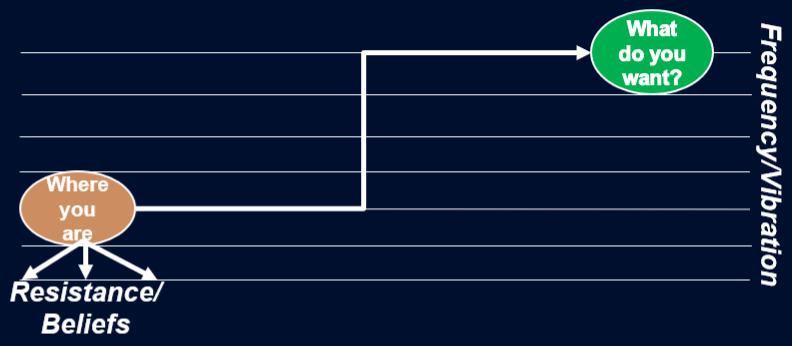

# Chapter 4: The Projection Model

*How the Field Broadcasts All Frequencies Simultaneously • Consciousness as Lens, Not Layer • Material Reality as Screen • The Fish Doesn't Know It's in Water*

---

## Chapter Overview

Reality isn't what we think it is. What we experience as solid, fixed material existence is actually a projection of vibrational frequencies from a formless substrate that mystics call Akasha and physicists call the quantum field. Like a fish swimming in water, we're immersed in this field so completely that we don't notice it, yet everything we experience operates according to its laws. This chapter introduces the seven universal laws that govern how energy moves from formless potential into material form, and why understanding these principles transforms resistance from an obstacle into a navigation system.

---

## The Laws We Can't Escape

Gravity doesn't care if you believe in it. Jump off a building, and you'll fall whether you understand Newton's equations or think you can fly. The same principle applies to the laws governing consciousness and manifestation. These aren't philosophical concepts or spiritual beliefs. They're the operating principles of reality itself.

You're already using them. Every moment of your life operates within these laws. When things flow easily, you're aligned with them. When you hit resistance, you're pushing against them. The difference between struggle and ease often comes down to whether you're working with the current or swimming against it.

Let me introduce you to the seven primary universal laws. I learned these from Bob Proctor. Think of these as the source code of reality, the fundamental principles that determine how energy moves from thought to form, from potential to actual.

### The Law of Vibration: Everything Is Moving

Nothing is truly solid. Everything vibrates. That desk in front of you, seemingly static and permanent, consists of atoms vibrating at tremendous speeds. The thoughts in your mind are electromagnetic patterns oscillating through neural networks. Your emotions are frequency patterns moving through your nervous system. Even what appears still is in constant motion.

This law is primary. It tells us that reality isn't made of "things" but of vibrating energy taking temporary forms. When you understand this, you realize that changing your life isn't about manipulating solid objects. It's about shifting frequencies. The implications are profound. If everything is vibration, then the difference between your current state and your desired state is just a difference in frequency. The gap between where you are and where you want to be isn't about physical distance. It's about vibrational alignment.

### The Law of Perpetual Transmutation: Energy Flows Downward

Energy moves in one direction: from formless to form, from thought to thing, from cause to effect. This is why consciousness comes first. The quantum field (what we might call Source or Akasha) holds all potential frequencies. Your consciousness selects which frequencies to tune into, like turning a radio dial. Those selected frequencies then cascade down through increasingly dense levels of reality until they materialize in physical form.

Top to bottom, always. This means trying to change your life by manipulating physical circumstances alone is backwards. You're working at the effect level, not the cause level. It's like trying to change your reflection by painting the mirror. The image comes from you, not from the glass.
When you grasp this law, you understand why mindset work and consciousness practices aren't just feel-good exercises. They're the actual levers of change. Shift the frequency at the top, and everything below reorganizes automatically.

### The Law of Relativity: Context Creates Meaning

Nothing exists in isolation. Everything gains its meaning through comparison and context. Ten thousand dollars seems like a lot of money. Compared to a hundred million, $10,000 is pocket change. Suddenly, ten thousand doesn't feel so significant. The number hasn't changed, but its meaning has shifted entirely based on what we compare it to. 

This law explains why perspective is everything. The size of your problem depends entirely on the frame you're viewing it through. Zoom out far enough, and the crisis consuming your attention becomes a tiny blip. Zoom in close enough, and a minor detail becomes overwhelming. Leaders understand this intuitively. When team members panic about obstacles, effective leaders don't dismiss the concern. They shift the context. They help people see the situation relative to the larger mission, the full timeline, the available resources. Same problem, different meaning.

You can use this law deliberately. Stuck in anxiety about a decision? Compare it to the scope of your entire life. That deadline feels crushing? Relative to a century, it's nothing. This isn't minimizing or bypassing. It's using relativity to restore proportion and regain perspective.

### The Law of Polarity: Everything Contains Its Opposite

Light cannot exist without dark. Up requires down. Hot only makes sense because cold exists. Every quality in reality has an opposite pole. Here's what most people miss. These aren't separate things fighting each other. They're opposite ends of the same spectrum. Heat and cold are both just different frequencies of molecular motion. Love and fear are different frequencies of energy moving through your nervous system. This law is crucial for understanding resistance. What you resist isn't foreign to you. It's the opposite pole of something you desire. You can't have one without the other existing as potential. The shadow side of your gift isn't a flaw to eliminate. It's part of the complete spectrum.

When Gene Keys talks about shadows, gifts, and siddhis, it's describing this law in action. The shadow isn't separate from the siddhi. They're the same frequency at different levels of consciousness. You don't destroy the shadow. You recognize it as part of the whole and allow it to resolve into its higher expression naturally. This changes everything about how you work with difficult emotions and limiting patterns. You're not trying to get rid of darkness and keep only light. You're recognizing that both exist within you as potential, and your state of consciousness determines which pole you experience.

### The Law of Rhythm: Everything Moves in Cycles

Tides come in and go out. Seasons change in predictable patterns. Your energy rises and falls throughout the day. Markets boom and crash. Everything oscillates. This law tells us that permanence is an illusion. What goes up must come down. What contracts will expand again. The rhythm is natural, unavoidable, built into the fabric of reality itself.

Tony Robbins built his pattern recognition framework on this law. Once you see the rhythm, you can anticipate it. You know that after the low comes the high. After winter comes spring. After the contraction comes expansion.

The mistake people make is trying to fight the rhythm. They want only the up cycle, only the expansion, only the high energy. But that's like wanting only the inhalation without the exhalation. It doesn't work. The rhythm continues whether you accept it or not. When you align with this law instead of resisting it, you stop panicking during the down cycle. You recognize it as part of the natural oscillation. You use the contraction phase to go inward, to integrate, to prepare. Then when the expansion phase returns (and it always does), you're ready to move with it.

### The Law of Cause and Effect: Nothing Happens by Chance

Every effect has a cause. Every cause produces effects. Nothing in reality is random. This law is what makes transformation predictable and reliable. Change the cause, change the effect. Every time. No exceptions.

Most people focus on effects. They want different results while maintaining the same thoughts, beliefs, and patterns that created the current results. They're trying to harvest a different crop without changing what they planted. When you truly understand this law, you realize that your current circumstances are the perfect effects of prior causes. Not as judgment, but as physics. You're experiencing the material manifestation of frequency patterns you've been broadcasting, consciously or unconsciously.

This is empowering, not limiting. If effects come from causes, then you have leverage. Identify the causal frequency patterns creating unwanted effects, shift those frequencies, and new effects must follow. It's mechanical. This is precisely what the Resistance Recode Framework does. It identifies the causal patterns (resistance mechanisms) creating limitation as effects, then shifts those patterns at the source level. The material circumstances reorganize automatically because the cause has changed.

### The Law of Gender: Creation Requires Both Polarities

Everything has both masculine and feminine aspects. Not in the biological sense, but as fundamental creative polarities. The Tao describes this as yin and yang. Masculine energy provides direction, focus, structure, penetration. Feminine energy provides receptivity, flow, nurturing, gestation. Creation requires both.

In your nervous system, sympathetic activation (masculine) provides drive and action. Parasympathetic regulation (feminine) provides rest and integration. Health requires both in dynamic balance. In manifestation work, masculine energy sets intention and takes action. Feminine energy receives, allows, trusts the timing. High-achievers commonly over-index on masculine energy. They drive, push, control. Then they wonder why they're exhausted and why things feel like constant struggle.

The framework teaches returning to the Tao, the neutral point where both polarities exist in balance. Not choosing one over the other, but recognizing both as necessary aspects of the creative process.

---

## The Formless Substance

Science and mysticism point to the same reality using different language.

Quantum physicists describe a field of pure potential underlying all matter. Before you measure a particle, it exists in superposition, all possibilities simultaneously present. The act of observation collapses possibility into actuality, potential into particle. Mystics have described this for millennia. They call it Akasha, the formless substance from which all form emerges. The unmanifest field containing every possible frequency, every potential reality.

Wallace Wattles, in *The Science of Getting Rich*, called it simply "Formless Substance." He described it as an intelligent, responsive medium that shapes itself according to the impressions we make upon it through thought. Different names, same principle: there is a substrate to reality. Everything you experience in the material world is a projection of vibrational patterns from this formless field into temporary forms.

Think of it like this: The quantum field broadcasts all frequencies simultaneously, like a radio tower transmitting every possible station at once. Your consciousness acts as the receiver, the tuner selecting which frequencies to pick up and translate into your experience. This is why the Law of Perpetual Transmutation matters. Energy moves from formless (pure potential in the field) to form (material reality). Top to bottom. Cause to effect. Frequency to form.

When you grasp this model, manifestation becomes comprehensible. You're not trying to create something from nothing. You're tuning into frequencies that already exist in the field. The "thing" you want already exists as a potential pattern in the quantum substrate. You're not manifesting it. You're removing the resistance patterns that block you from recognizing and experiencing that frequency.

This is timeline recognition versus manifestation. Multiple timelines exist simultaneously in the field as potential. Your work isn't to create the desired timeline. It's to become a vibrational match to it by dissolving the resistance patterns that keep you locked into a different frequency.

Image: _Frequency Alignment: Our work is to visualize what we want (in a higher vibration than we currently operation) and become a vibrational match to it. What keeps us stuck is resistance our limited beliefs. Resistance and limited beliefs pull our vibration downward._

The field is expansive by nature. Energy wants to move, to grow, to evolve. When you align with this natural expansion, you experience flow, ease, synchronicity. When you resist it, you experience contraction, struggle, disconnection. Think about a time when everything seemed effortless. When opportunities appeared, connections happened naturally, obstacles dissolved on their own. That's what alignment with the field's expansive nature feels like. You weren't working harder. You were simply allowing the natural current to carry you.

Now think about times of struggle. When you pushed, forced, tried to make things happen through sheer will. That's resistance. You were contracting against the field's natural expansion, and it exhausted you. The formless substance responds to frequency. It doesn't judge, doesn't withhold, doesn't require you to earn it. It simply reflects back whatever frequency patterns you're broadcasting. Your consciousness determines what you experience, not by creating it, but by selecting it.

---

## Why We Can't See the Projection

If everything is just vibration from a formless field, why does reality seem so solid? Why do we experience ourselves as separate beings in a world of distinct objects? This is because everything vibrates at tremendous speed. The desk appears solid because its atoms are vibrating so fast that your senses can't detect the motion. It's like a fan blade spinning so quickly it becomes an invisible disc. The motion is there, but it's moving too fast to perceive.

Your thoughts seem instantaneous, but they're actually electromagnetic waves oscillating through neural networks at measurable frequencies. What feels like a single thought is actually millions of neurons firing in coordinated patterns, creating a frequency that you experience as an idea or feeling. The quantum field itself operates at frequencies beyond our sensory threshold. We can measure its effects, detect its influence, but we can't perceive it directly any more than a fish can see water. 

This brings us to one of my favorite analogies: the fish in water.

A fish doesn't know it's in water. It has no frame of reference for "not water." Water is simply the medium of its existence, so invisible it doesn't require acknowledgment. Yet the fish is completely bound by water's rules. It can't breathe air. It can't ignore buoyancy. It moves according to currents and pressure gradients whether it understands them or not.

We are the fish. The quantum field is the water.

We don't notice the field because we've never experienced anything else. It's the medium we swim in, so ubiquitous that it's invisible. Our education teaches us to focus on objects, on the forms, on the material manifestations. Nobody taught us to see the field itself. Like the fish bound by water's laws, we're bound by the field's principles. The seven universal laws aren't optional. We can't opt out of vibration, polarity, rhythm, or cause and effect. We're operating within these parameters whether we acknowledge them or not.

Ignorance of the laws doesn't mean they don't impact you. You can live your entire life unaware of the Law of Vibration, but that doesn't stop everything from vibrating. You can dismiss the Law of Cause and Effect, but your actions still produce results. You can ignore the Law of Rhythm, but cycles continue regardless.

Here's what changes when you become aware. Instead of being unconsciously buffeted by forces you don't understand, you can work with them deliberately. You can align with the rhythms instead of being thrown by them. You can use polarity instead of being confused by it. You can shift causes knowing effects must follow.

The laws are like gravity. When you don't know about it, you simply avoid heights instinctively. When you understand it, you can build airplanes. The law hasn't changed. Your relationship to it has. This is what makes resistance such a valuable feedback mechanism. When you feel resistance, contraction, or struggle, it's not a sign that something's wrong with you. It's information that you're pushing against one of these fundamental laws. Flow happens when you align with the laws. Resistance happens when you work against them.

The leader who burns out trying to control every outcome is violating the Law of Gender, operating only in masculine drive without feminine receptivity. The entrepreneur who panics during a market downturn is fighting the Law of Rhythm instead of recognizing the natural cycle. The perfectionist demanding flawless execution is resisting the Law of Polarity, wanting only one side of the spectrum.

None of this is personal failure. It's just physics. You're experiencing the natural consequences of moving against the current rather than with it.

---

## The Screen, The Lens, The Broadcast

Let's refine the projection model into its three core components.

**The Broadcast:** The quantum field transmits all possible frequencies simultaneously. Every potential reality, every possible timeline, every conceivable outcome exists as a vibrational pattern in the field. It's all there, all the time, broadcasting like countless radio stations on an infinite dial.

**The Lens:** Your consciousness acts as the selecting mechanism. Not as a layer between you and reality, but as the lens that focuses and filters which frequencies get through. Your beliefs, your nervous system state, your habitual thought patterns, these create the aperture through which certain frequencies pass while others don't register at all.

**The Screen:** Material reality is what appears when selected frequencies collapse from potential into form. The "stuff" of your life, your circumstances, relationships, health, finances, these are the projection on the screen of consensus reality.

This model explains why two people can be in the same situation and have completely different experiences. Same broadcast, different lens. Their consciousness selects different frequencies, so they literally experience different realities from the same field of potential. It's not that one person is right and the other wrong. They're both accurately experiencing the frequencies they're tuned to. Change the lens, change what appears on the screen. Same broadcast, different reception.

This is why arguing about whose reality is "real" misses the point entirely. All possible realities are real in the field. Which one you experience depends entirely on your consciousness acting as the selection mechanism. Now here's the crucial insight: you can't change the broadcast. The field contains what it contains. But you can absolutely change the lens.

This is what the Resistance Recode Framework does. It identifies the distortions in your lens (resistance patterns, limiting beliefs, nervous system dysregulation) and clears them. As the lens clarifies, different frequencies become accessible. New timelines come into focus. Different realities become inevitable. You're not creating something new. You're removing the blocks that prevented you from recognizing what was always available in the broadcast.

---

## Preparing for Geometry

We've established the foundation: reality operates according to universal laws, emerges from a formless substance that responds to vibration, and manifests as a projection of frequencies selected by consciousness. There's another layer to understand. The field doesn't just broadcast randomly. It follows specific patterns. Nature doesn't evolve arbitrarily. It follows geometric templates.

Why do honeycombs form hexagons? Why do galaxies spiral? Why does your DNA twist in a double helix? Why do plants grow in Fibonacci sequences? Because the formless substance organizes itself according to geometric principles. The same patterns appear at every scale, from subatomic particles to cosmic structures. This isn't coincidence. It's how reality works.

In the next chapters, we'll explore the geometry of evolution, starting with the most fundamental pattern: the Seed of Life. This ancient symbol isn't just sacred geometry mysticism. It's the actual operating system that nature uses to organize energy into form. Once you see these patterns, you can't unsee them. They're everywhere. And understanding them gives you another lever for working with reality instead of against it.

First, let the projection model settle. Sit with the idea that you're not trapped in a fixed reality. You're swimming in a field of infinite potential, and your consciousness determines which frequencies you experience. The laws are constant. The broadcast contains everything. Your lens is the variable. That's both humbling and empowering. You can't change the rules. But within those rules, you have more freedom than you probably realized.

---

## What's Next

In Chapter 5, we'll explore sacred geometry as reality's operating system. You'll discover why evolution follows geometric patterns, how the Seed of Life operates fractally from atoms to galaxies, and what this means for understanding your own transformation process. The circle, the radius, the expansion. The same pattern at every scale.

---

[Next Chapter](Not Released)

[Return to The Table of Contents](../TableOfContents.md)

## Notes for Readers

*This chapter was released on January 26, 2026. 

**Feedback welcome:** 